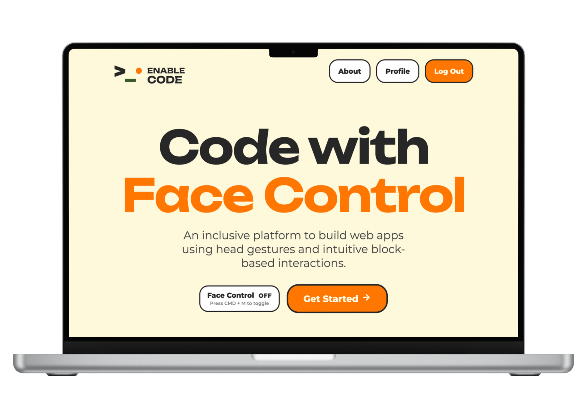
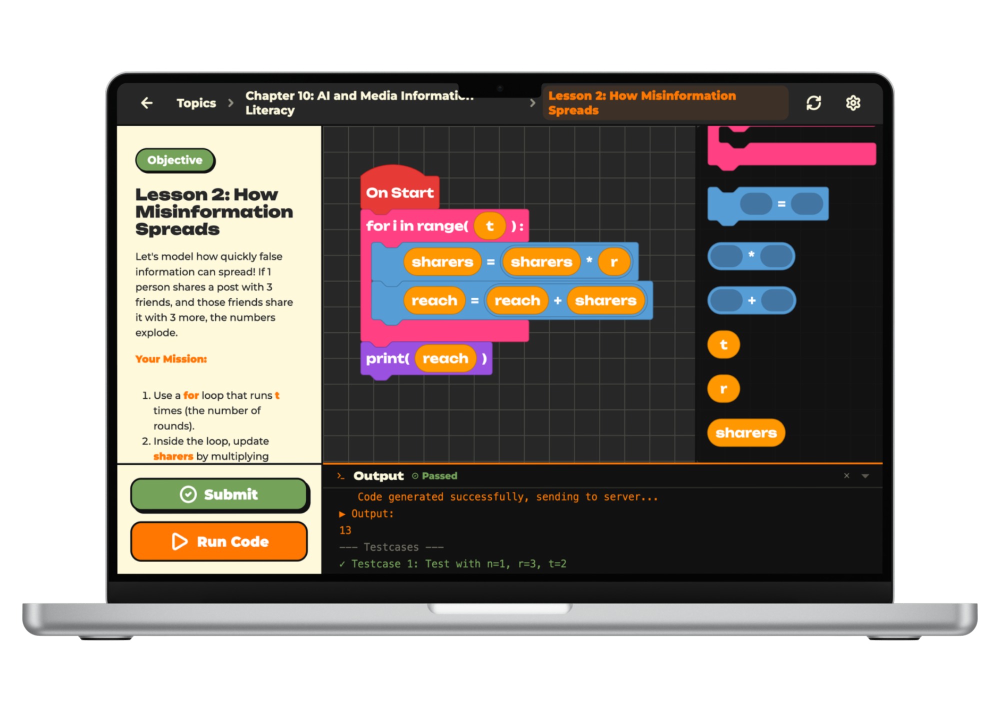

# Enable Code — Frontend

A hands-free coding platform: control the interface with facial gestures (**Face Control**) and build programs with visual blocks (**Blockly**). Enable Code is built for learners with limited motor ability — a laptop webcam is enough, with no extra assistive hardware.

> **Tagline:** _Code with Face Control_ — build web apps using head gestures and block-based interactions.

---

## Table of Contents

- [Demo](#demo)
- [Features](#features)
- [Tech Stack](#tech-stack)
- [Prerequisites](#prerequisites)
- [Getting Started](#getting-started)
- [Environment Variables](#environment-variables)
- [Available Scripts](#available-scripts)
- [Project Structure](#project-structure)
- [Application Routes](#application-routes)
- [Face Control](#face-control)
- [Backend Integration](#backend-integration)
- [Deployment](#deployment)
- [Development Guidelines](#development-guidelines)
- [Design Reference](#design-reference)
- [License](#license)

---

## Demo

<table>
  <tr>
    <td align="center" width="50%">
      <strong>Homepage</strong><br />
      
    </td>
    <td align="center" width="50%">
      <strong>Code Space</strong><br />
      
    </td>
  </tr>
</table>

---

## Features

- **Face Control** — [MediaPipe Face Mesh](https://developers.google.com/mediapipe/solutions/vision/face_landmarker) tracks head movement to drive an on-screen cursor; open your mouth to click or drag. Toggle quickly with `Ctrl/Cmd + M`.
- **Block-based programming** — Blockly workspace with a large drop zone and custom blocks that follow Python-like syntax, optimized for hands-free interaction.
- **Structured learning path** — Topics and lessons with lock/unlock states, progress tracking, hints, and a submission flow.
- **9-point calibration** — Per-user calibration for head range and mouth opening before longer sessions.
- **Face login** — Face recognition sign-in and registration, alongside email and password.
- **Internationalization** — Full UI support for English and Vietnamese.
- **Profiles & leaderboard** — JWT sessions with refresh tokens, profile management, learning stats, and global rankings.

---

## Tech Stack

| Layer        | Technology                          |
| ------------ | ----------------------------------- |
| UI framework | React 19 + TypeScript               |
| Build tool   | Vite 8                              |
| Routing      | React Router 7                      |
| HTTP client  | Axios (interceptors, token refresh) |
| Block editor | Blockly 12                          |
| Icons        | Lucide React                        |
| Markdown     | react-markdown                      |
| Face Control | MediaPipe Face Mesh (CDN)           |
| Deployment   | Vercel (SPA)                        |

---

## Prerequisites

- **Node.js** 18 or later
- **npm** (or pnpm / yarn)
- **Webcam** — required for Face Control and face login
- **Desktop browser** — mobile devices are intentionally blocked (`MobileUnsupported`)

---

## Getting Started

```bash
# Clone the repository
git clone <repository-url>
cd EnableCode/EnableCode_FE

# Install dependencies
npm install

# Start the development server
npm run dev
```

Open the URL printed by Vite in your terminal (default: `http://localhost:5173`).

To run against a local backend, start the API server first (default: `http://localhost:5000/api`), then launch the frontend.

---

## Environment Variables

Create a `.env` file in the frontend root when you need to point at a non-default API:

```env
VITE_API_URL=http://localhost:5000/api
```

If `VITE_API_URL` is not set, the app falls back to `http://localhost:5000/api`.

> Vite only exposes variables prefixed with `VITE_`. Restart the dev server after changing `.env`.

---

## Available Scripts

| Command           | Description                                               |
| ----------------- | --------------------------------------------------------- |
| `npm run dev`     | Start the Vite dev server with HMR                        |
| `npm run build`   | Type-check with TypeScript and produce a production build |
| `npm run preview` | Serve the production build locally                        |
| `npm run lint`    | Run ESLint across the project                             |

---

## Project Structure

```
src/
├── api/              # REST clients (auth, lessons, topics, profile, progress, leaderboard)
├── blockly/          # Blockly blocks, toolbox, theme, workspace evaluation
├── components/       # Shared UI (Mouse cursor, BlocklyEditor, sidebar, toggles, …)
├── context/          # React context (Auth, EyeTracking / Face Control, Calibration)
├── hooks/            # Custom hooks (e.g. useIsMobile)
├── i18n/             # Locale messages (en, vi) and I18n provider
├── lib/              # Domain helpers (progress, curriculum, avatar, types)
├── pages/            # Route-level pages
├── styles/           # Global CSS, component styles, Blockly overrides
└── utils/            # Mappers and small utilities

public/               # Static assets (favicon, icons, logo)
docs/screenshots/     # Product screenshots used in this README
```

---

## Application Routes

| Path                   | Page              | Description                                                 |
| ---------------------- | ----------------- | ----------------------------------------------------------- |
| `/`                    | Home              | Product overview, Face Control toggle, Get Started CTA      |
| `/camera-permission`   | Camera permission | Request webcam access before enabling Face Control          |
| `/login`               | Login             | Email / password sign-in                                    |
| `/register`            | Register          | Account creation                                            |
| `/face-login`          | Face login        | Sign in with face recognition                               |
| `/face-register`       | Face register     | Register a face embedding                                   |
| `/forgot-password`     | Forgot password   | Request a password reset                                    |
| `/reset-password`      | Reset password    | Set a new password                                          |
| `/lessons`             | Topics            | Browse learning topics                                      |
| `/lessons/:topicId`    | Lessons           | Lessons within a topic                                      |
| `/workspace/:lessonId` | Workspace         | Block editor, lesson objectives, and output panel           |
| `/settings`            | Profile           | User profile, stats, language, and Face Control preferences |
| `/calibration`         | Calibration       | 9-point gaze / mouth calibration                            |

Protected flows rely on JWT access tokens stored in `localStorage`, with automatic refresh via HTTP-only cookies.

---

## Face Control

1. Enable tracking from the home page or press `Ctrl/Cmd + M`.
2. Grant webcam permission when prompted.
3. Run calibration at `/calibration` before long sessions for better accuracy.
4. A virtual cursor follows your head movement; click and drag actions are derived from face landmarks (mouth opening).

The enabled/disabled state persists in `localStorage` under the key `enablecode.eyeTrackingEnabled`.

---

## Backend Integration

The frontend expects a REST API compatible with the clients in `src/api/`. Key endpoint groups:

| Area          | Endpoints                                                                                   |
| ------------- | ------------------------------------------------------------------------------------------- |
| Auth          | `POST /auth/login`, `/auth/register`, `/auth/refresh-token`, `/auth/logout`, password reset |
| Face auth     | `POST /auth/face-login`, `PUT /auth/embedding`                                              |
| Topics        | `GET /topics`, `GET /topics/:id/lessons`                                                    |
| Lessons       | `GET /lessons`, `GET /lessons/:id`, progress, submit, hints, solution                       |
| Users         | `GET/PUT/DELETE /users/profile`, `GET /users/stats`, calibration settings                   |
| Progress      | `GET /progress`, `GET /progress/:lessonId`                                                  |
| Leaderboard   | `GET /leaderboard`                                                                          |
| Custom blocks | `GET/POST/PUT /custom-blocks`                                                               |

Requests use `withCredentials: true` for refresh-token cookies. See `src/api/axiosClient.ts` for interceptor behavior (401 handling, token refresh, session expiry events).

---

## Deployment

The project is configured for [Vercel](https://vercel.com) as a single-page application. `vercel.json` rewrites all routes to `index.html`.

```bash
npm run build
```

Build output is written to `dist/`. Set `VITE_API_URL` in your hosting provider to the production API base URL before building.

---

## Development Guidelines

- **Commits** — Follow [Conventional Commits](https://www.conventionalcommits.org/); enforced via Husky and Commitlint.
- **Formatting** — Prettier and ESLint run on staged files through lint-staged before each commit.
- **Branding** — Use `/logo/TL_App_Logo.png` on light backgrounds and `/logo/TD_App_Logo.png` on dark backgrounds.
- **Scope** — Keep API changes in sync with the backend (`EnableCode_BE`). Types live in `src/lib/types.ts`.

---

## Design Reference

UI implementation follows the Enable Code Figma design:

[Figma — Enable Code UI/UX Design](https://www.figma.com/make/RlxTkeDp7lExAGRl7ocRjg/Enable-Code-%7C-UI-UX-Dessign)

---

## License

Private project — contact the repository owner for usage terms.
